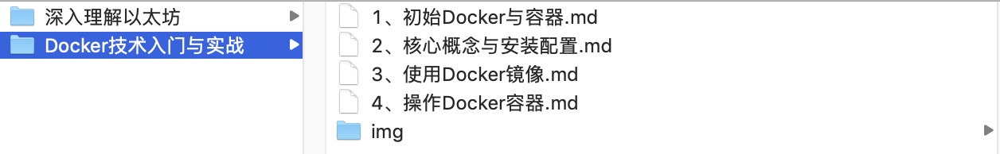

# JiangXiSoftwareUniversity
江西软件大学专业共建课程资料

## 说明
此项目用于存放专业共建课程备课资料，按照备课计划的分工，以课程名称命名目录，目录中包含本课程的所有备课文档和备课资料。

#### 示例：



如上图所示目录**Docker技术入门与实战**目录为《Docker技术入门与实战》教材的备课资料，内含该课程的备课教师于洪伟整理的该教材的备课内容。备课资料包括但不限于markdown文档、图片、resource源码和案例等。

## 维护人员名单及职责说明

* @李鹏飞：同步备课目标和备课任务，跟进备课进度；把控备课质量，评估备课结果；
* @于洪伟：协助李鹏飞分配备课计划；认领备课计划；执行备课任务；协助评估和把控备课质量；
* @王安川：同步备课目标；认领备课任务；执行备课任务；说明备课进度，提交备课结果；
* @靳威威：同步备课目标；认领备课任务；执行备课任务；说明备课进度，提交备课结果；
* @代继鹏：同步备课目标；认领备课任务；执行备课任务；说明备课进度，提交备课结果；
* @王梓衡：同步备课目标；认领备课任务；执行备课任务；说明备课进度，提交备课结果；

## 提交要求及更新频率

#### 提交格式和要求

为保证格式统一，请提交前阅读本说明文档，或者向李鹏飞/于洪伟询问提交规范，确保提交的内容格式统一。每次提交前先更新，后提交，并通过备注描述清楚本次更新的内容。步骤如下所示：

```
git pull origin main
git add .
git commit -m "本次提交内容说明"
git push origin main
```


## 最后更新时间
2021年4月7日

