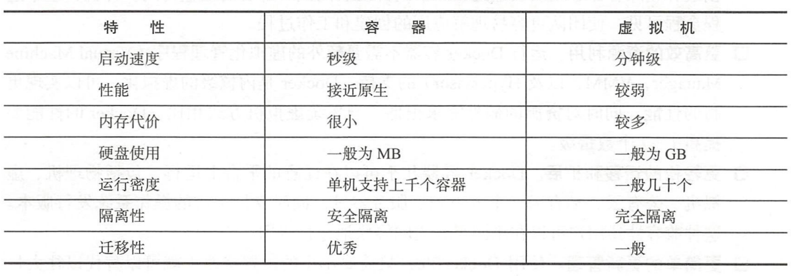
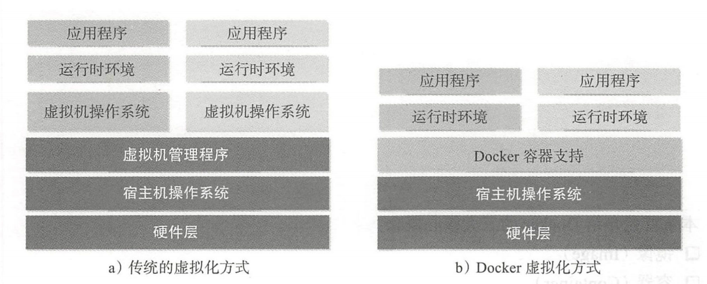

## 初始Docker与容器

**@author：于洪伟**

#### 一、什么是Docker

##### 1、背景

* 兴起：Docker是基于Go语言实现的开源容器项目，诞生于2013年初，由dotCloud公司发起。Docker目前已经成长为全球最大的Docker容器服务提供商。
* 官方网站：docker.com
* 发展及现状：Docker项目已经加入Linux基金会，遵循Apache2.0协议。Docker代码全部开源在https://www.github.com/docker 项目仓库中。目前Docker已经支持Linux、macOS、Windows等操作系统。

###### 2、容器技术

* Docker的基础是基于Linux容器，即Linux Containers，简称为LXC技术。早期的Docker代码实现是直接基于LXC的，从0.9版本开始，Docker才开发了libcontainer项目作为更广泛的容器驱动进行实现，替换掉了底层基于LXC的实现。

* Docker：简单的讲，Docker容器类似于一种轻量级的沙盒（sandbox）。每个容器内均运行着一个应用，不同的容器相互隔离，容器之间也可以通过网络互相通信。容器的创建和停止十分迅速，几乎和创建和终止原生应用一样；另外，容器对系统资源的额外需求也十分有限，远低于传统的虚拟机。

#### 二、为什么要使用Docker

###### 1、Docker容器的优点

* 虚拟化效率高：通过Docker进行容器虚拟化，可以使得应用的部署脱离底层物理硬件的限制，不再需要耗费大量的人力物力等额外资源进行繁琐的环境配置等工作。Docker通过容器来打包应用、解耦应用和运行平台，使得在应用进行迁移的时候，只需要在新的服务器上启动需要的容器就可以完成。
* 开发和运维中方便：
  * 使用Docker可以通过镜像来快速构建一套标准的开发环境，使得达到更快速的交付和部署的目的。
  * 运行Docker容器不需要额外的虚拟化管理（VMM，Hypervisor）的支持，Docker是内核级的虚拟化，可以实现更高的性能。
  * Docker容器能够在任意平台上运行，这使得可以实现更轻松的迁移和扩展。
  * 使用Dockerfile文件，实现Docker容器的各项配置，可以实现更高效更简单的管理。

###### 2、Docker 与虚拟机的比较

Docker的优点：

* Docker容器速度快，启动和停止秒级效率，传统的虚拟机要数分钟甚至更长；
* Docker容器对系统资源使用需求少，一台主机可以运行很多个Docker；
* 通过类似Git的操作来实现用户获取、应用分发和更新镜像等操作，效率高；
* 通过Dockerfile文件配置实现灵活的自动化创建和部署机制，极大的提高工作效率，实现流程标准化。

Docker容器与虚拟机的特点比较如下：

#### 三、Docker与虚拟化

* 定义虚拟化：英文单词virtualization，虚拟化技术是一个通用概念。在计算机领域，通常指计算虚拟化（computing virtualization），或者服务器虚拟化。在计算机技术中，虚拟化技术是一种资源管理技术，是将计算机的各种实体资源，比如服务器、网络、内存及存储等，通过抽象、转换后展示出来，打破物理实体的不可切割的障碍，使用户可以使用到比原来更好的方式来应用所存在的资源。
* 虚拟化特点：虚拟化的核心是对资源进行抽象管理，目的是为了实现在同一个物理主机上同时运行多个系统或者应用，从而提高系统资源的使用效率或者利用率。

Docker与常见的虚拟机方式的对比与不同之处如下图所示：

传统的方式是在硬件层面实现虚拟化，需要有额外的虚拟机管理引用和虚拟机操作系统层。Docker容器是在操作系统层面上实现虚拟化，直接复用本地主机的操作系统，量级更轻更小。

​	