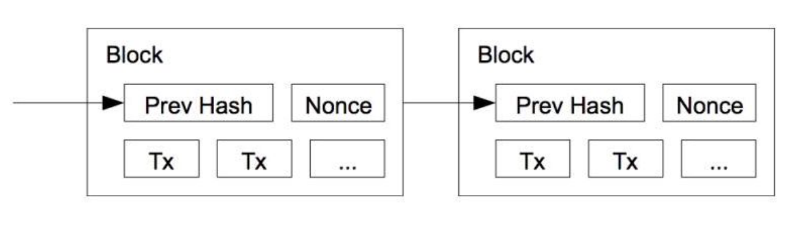
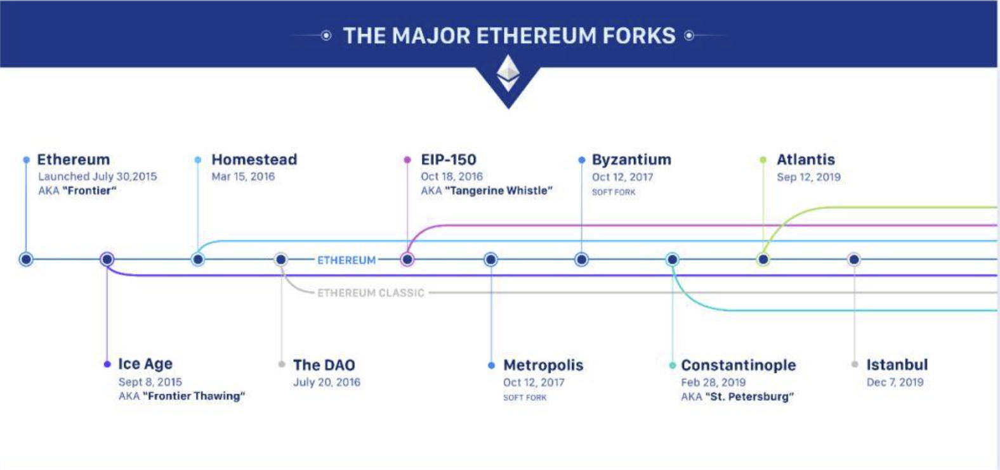

## 以太坊概述

**@author：于洪伟**

#### 1、区块链技术及历史溯源

* 比特币：2008年，匿名开发者"中本聪"发表了比特币的白皮书——《比特币：一种点对点的电子现金系统》。中本聪所说的点对点的电子现金系统，就是后来的比特币。比特币是历史上使用技术手段使得可以独立于任何国家、任何机构，以及任何第三方而独立运行的系统。

* 区块链：在比特币的论文中，第一次出现了Blockchain的概念，中本聪在比特币系统中通过时间戳和工作量证明算法的方法解决了双花和多节点数据同步的难题。

* 区块：由中本聪提到了使用区块的方式记录交易数据的存储和查询，以及一系列保证数据不会被篡改的机制，并将区块与区块进行连接，形成链式结构，可供查询。如下所示，即是比特币及区块链的基本工作模型：

  

关于比特币及区块链的基本特点和特性，参见《精通区块链编程》一书的内容。

总结：

* **区块链最重要的是解决了中介信用问题。**在过去，两个互不认识的人要达成协作是非常困难的，必须要依靠第三方。比如最常见的线上支付问题，在过去任何一次的转账行为，都必须要经过银行或者其他第三方支付机构的存在。但是通过区块链技术，通过比特币，人类第一次实现了在没有任何的中介机构参与的情况下，可以完成双方彼此互信的转账行为，这是区块链从技术角度为解决人类社会的信任问题而做出的重大突破。

* **区块链与比特币的关。**区块链是比特币的底层技术，区块链技术的真实的应用价值远远超过其在电子货币系统这一单一领域的应用价值。
* **区块链的代际和版本。**通常，将以比特币为代表的电子货币系统时代的区块链技术称之为1.0时代；随着区块链技术受到越来越多的人的关注，并且随着技术的不断发展 ，当区块链技术中提出了智能合约的概念，开始使用区块链技术实现电子货币以外的区块链应用时，我们就认为进入了区块链2.0时代。

#### 2、以太坊

* 起源：在比特币之后，关注比特币发展和社区人员开始如何利用比特币系统的底层技术实现更广阔的落地实践，在这样的背景下，诞生了至目前为止除比特币之外，最为著名的以太坊系统。

  

* 白皮书：2013年年底 ，一个名为Vitalik Buterin的比特币社区爱好者，提出了让区块链本身具有可编程能力来实现复杂商业逻辑运算的构想，并将该想法付诸实践写成了一篇论文发布出来，这就是以太坊的白皮书。

  

* 项目成立：2014年1月，在北美比特币大会上Vitalik正式向外界宣布以太坊项目的成立，包括Vitalik Buterin、Gavin Wood以及 Jeffery Wilcke在内的联合创始人开始进行智能合约平台的开发。

  

* 以太坊黄皮书：2014年4月，Gavin发表了以太坊黄皮书，明确定义了以太坊虚拟机（EVM）的实现规范。根据以太坊黄皮书的描述，该技术规范由7种编程语言（C++、Go、Python、Java、JavaScript、Haskell 和 Rust）实现。

  

* 以太坊预售计划：2014年6月，以太坊发布了其网络代币以太币的预售计划，预售资金由位于瑞士楚歌的以太坊基金会进行管理。2014年7月，以太坊进行了为期42天的公开代币销售，总共售出60102216个以太币，接收到31591个比特币。

  

* Olympic网络公测：经历了2014、2015两年的持续不断的开发和完善，第9代技术原型测试网络Olympic开始公测，特别是以太坊的核心组件的功能测试，比如以太坊虚拟机、网络和PoW共识机制等。

  

* Frontier版本：2015年7月30日，以太坊的系统的第一个版本Frontier网络正式发布，开发者们开始在Frontier网络上开发去中心化应用，矿工开始加入网络进行挖矿。**Frontier是以太坊发展过程中的第一个里程碑。**该版本虽然定位是beta版本，但是却向广大开发者们展示了超出预期的功能和效果。

  

* Homestead版本：2016年3月14日（π日），以太坊平台的第二个主要版本Homestead对外发布，同时也是以太坊发布的第一个正式版本。Homestead版本的标志是在区块高度为1150000时，系统通过自动升级来完成。**Homestead引入了EIP-2、EIP-7和EIP-8在内的几项后项不兼容改进，所以Homestead其实是以太坊的一次硬分叉。**该硬分叉表示所有的以太坊节点均需要提前完成版本升级，从而与主链的数据保持同步。

  

* The DAO事件：2016年6月，DEVCON-2开发者大会在中国上海举行，会议的主题聚焦在智能合约和网络安全上。6月17日，以太坊平台上的一个智能合约项目因为程序漏洞而受到了黑客攻击，发生了以太坊被盗事件，该攻击事件造成360万以太坊被黑客盗走。解决方案：通过社区投票最终决定在1920000区块高度实施硬分叉，分叉后The DAO合约中的所有资金被退回到众筹参与人的账户中。经历了被盗事件后的硬分叉，以太坊分叉为ETH和ETC两个项目。

* Metropolis版本：2017年9月18日，开发团队开始测试“大都会”（Metropolis）版本的第一阶段：拜占庭分叉。2017年10月16日，以太坊主网在4370000区块高度完成拜占庭分叉，此次硬分叉的主要变化有以下几个方面的内容：
  * 为智能合约的开发者提供更灵活的参数；
  * 为后期大都会升级引入的zkSnarks零知识证明等技术做了准备；
  * 延迟引爆难度炸弹，将冰河期推迟1年；
  * 以太坊主网挖矿难度显著降低，提高了以太坊平台的交易速度，矿工挖矿对应的奖励从每个区块5个奖励降低至3个；

* 君士坦丁堡分叉：2019年3月，大都会版本的第二个阶段——君士坦丁堡硬分叉顺利完成。

* 以太坊的发展规划：2017年11月，DEVCON-3 开发者在墨西哥召开，在此次开发者大会上， Vitalik Buterin对PoS共识和分片技术做了说明介绍；除此之外，其他开发者演讲的主题还涉及了形式化证明、智能合约、zkSNARKs零知识证明、Whisper和Swarm组件、数字钱包、DApp等重要技术方向。

* Serenity版本：以太坊规划的最终版本为Serenity，在此阶段，以太坊将彻底从PoW转换到PoS（权益证明），主要的目的在于通过升级PoS和分片等技术解决以太坊的扩展性问题。Serenity版本又称之为以太坊2.0，也称ETH 2，在Serenity版本之前的三个阶段都称之为以太坊1.0阶段。

  * 伊斯坦布尔分叉：2019年12月7日，以太坊完成了伊斯坦布尔硬分叉升级。经历此次升级，意味着以太坊在迈向2.0的阶段又迈进了一步。

  * 柏林升级：2020年12月1日，以太坊2.0信标链正式启动，标志着以太坊2.0正式拉开帷幕。

    

#### 3、以太坊核心技术

##### 3.1、智能合约

